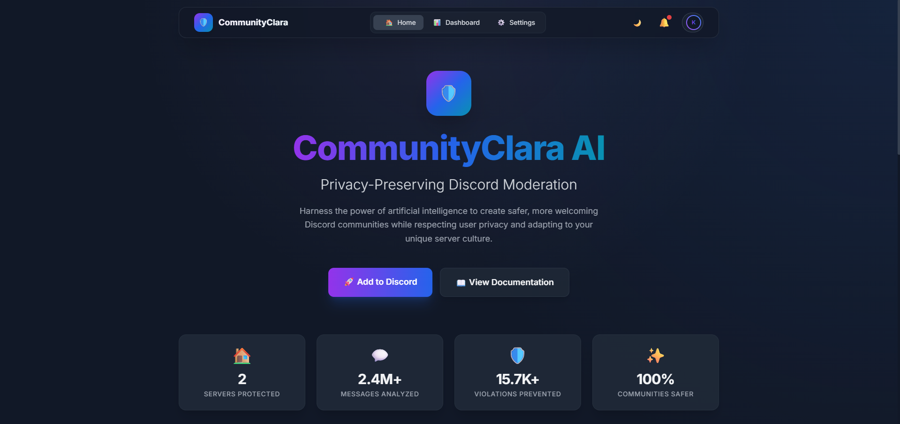
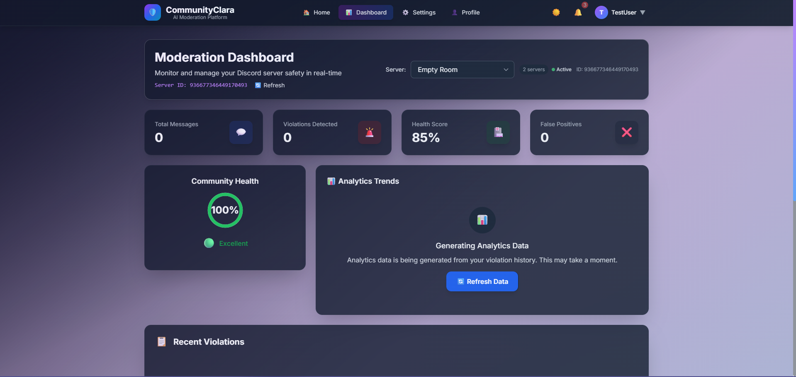
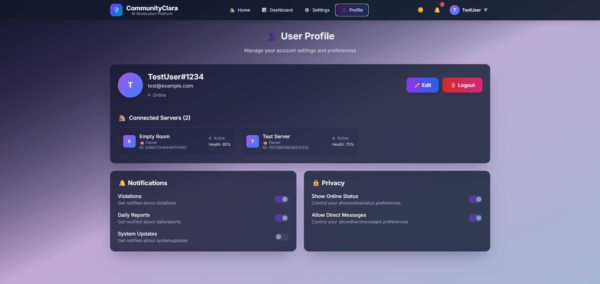
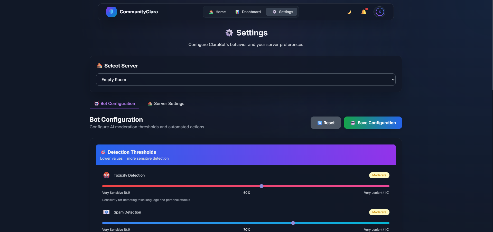
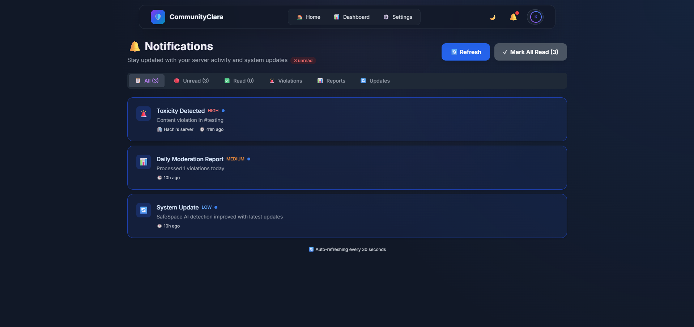
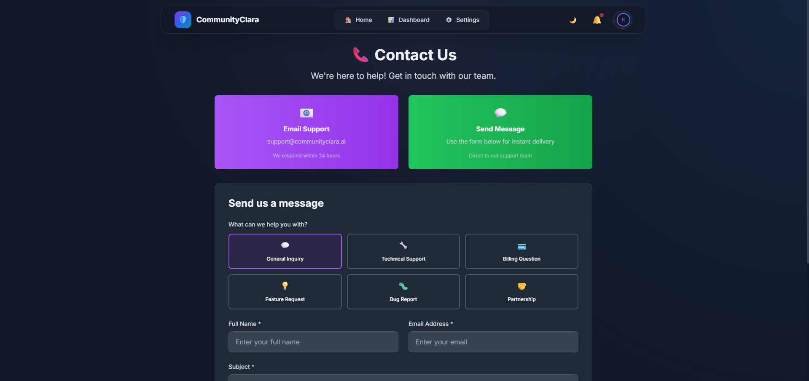
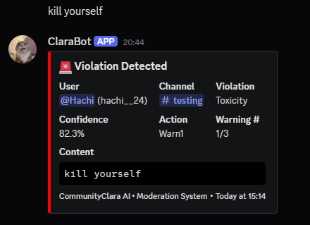
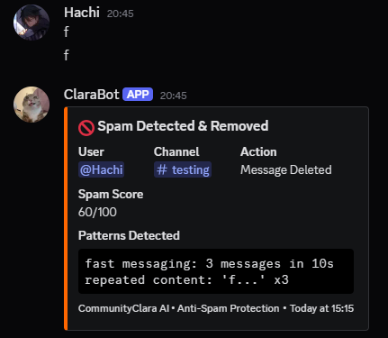
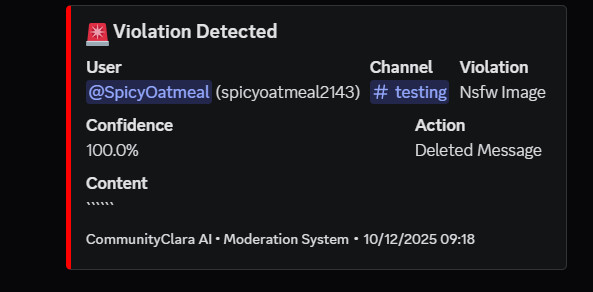

# 🛡️ CommunityClara AI

**Privacy-Preserving Discord Moderation with AI-Powered Content Analysis**

🌐 **Live Website:** [https://community-clara.vercel.app/](https://community-clara.vercel.app/)

[](https://discord.com/oauth2/authorize?client_id=1399461751552213123&permissions=1099646233670&integration_type=0&scope=bot+applications.commands)
[](https://python.org)
[](https://reactjs.org)
[](https://fastapi.tiangolo.com)
[](LICENSE)

## 🌟 Features

### 🤖 AI-Powered Content Moderation
- **Advanced NLP Analysis** - Uses `toxic-bert` detection via Hugging Face Transformers.
- **Multi-Category Detection**: Identifies NSFW, Toxicity, Harassment, Spam, Hate Speech, Threats, and Self-Harm.
- **Configurable Sensitivity** - Adjust strictness thresholds (0.0 - 1.0) per server.
- **Image Analysis** - Detects NSFW content in image attachments.

### 🔒 Privacy-First Architecture
- **Data Minimization** - Stores only violation metadata, not full chat logs.
- **Adaptive Learning** - Self-tunes thresholds based on false-positive feedback without retraining.
- **Server-Specific Silos** - Each community has its own isolated configuration and rules.

### ⚡ Real-Time Discord Integration
- **3-Strike System** - Progressive enforcement: Warning → Final Warning → Action (Timeout/Ban).
- **Smart Spam Detection** - Heuristic algorithm to catch rapid-fire spam and repetition.
- **Automated Actions**: Auto-delete, Auto-timeout, and Auto-kick capabilities.
- **Moderation Logs**: Detailed embed reports sent to designated admin channels.

### 📊 Comprehensive Analytics Dashboard
- **Live Health Score** - Real-time community safety metric (0-100%).
- **Violation Trends** - Interactive charts showing toxicity patterns over time.
- **Server Management** - update bot settings directly from the web interface.

## 📸 Screenshots

### 🖥️ Web Interface

| Landing Page | Dashboard | Profile |
|:---:|:---:|:---:|
|  |  |  |

| Settings | Notifications | Contact Support |
|:---:|:---:|:---:|
|  |  |  |

### 🤖 Discord Bot Alerts

| Toxicity Alert | Spam Alert | NSFW Violation |
|:---:|:---:|:---:|
|  |  |  |

---

## 🚀 Quick Start

### Prerequisites
- Python 3.9+
- Node.js 18+
- Discord Bot Token
- Google OAuth Client ID (for dashboard login)

### 1. Clone & Setup
```bash
git clone https://github.com/Tab-To-LightSpeed24/CommunityClara.git
cd CommunityClara

# Backend setup
cd backend
python -m venv venv
# Windows:
venv\Scripts\activate
# Mac/Linux:
source venv/bin/activate

pip install -r requirements.txt
```

### 2. Frontend Setup
```bash
cd ../frontend
npm install
```

### 3. Environment Variables
Create a `.env` file in `backend/` with:
```env
DISCORD_BOT_TOKEN=your_token_here
GOOGLE_CLIENT_ID=your_google_client_id
SECRET_KEY=your_random_secret
API_HOST=0.0.0.0
API_PORT=8000
```

### 4. Run Application
**Backend:**
```bash
# In backend folder
python run_with_bot.py
```

**Frontend:**
```bash
# In frontend folder
npm run dev
```

Visit `http://localhost:5173` to access the dashboard!
